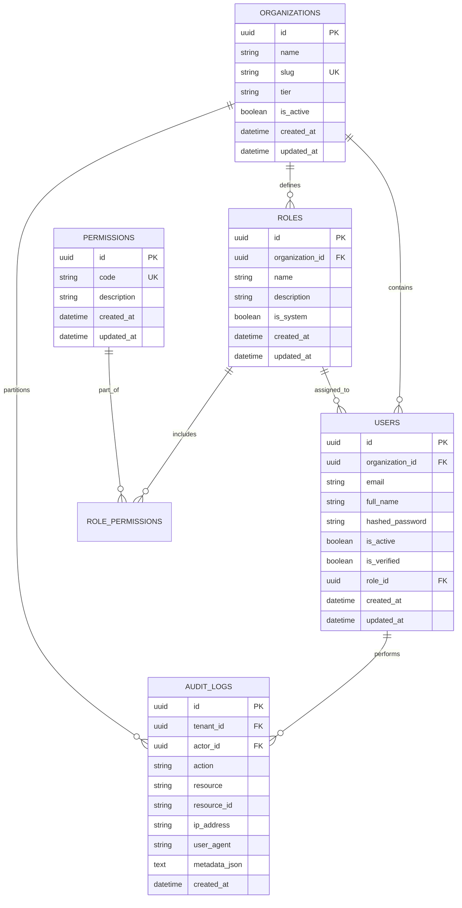

# Enermax CRM — Database Architecture & Migrations

## 1. Database Philosophy

PostgreSQL is the single, authoritative source of truth for all Enermax CRM business operations. Data consistency and transactional integrity take priority over convenience.

### Key Database Conventions:
* **UUID Primary Keys**: Every table uses a version-4 UUID as its primary key to eliminate enumeration attacks and simplify distributed data ingestion.
* **Timestamps**: All records include timezone-aware `created_at` and `updated_at` timestamps using database server time (`func.now()`).
* **Tenant Scoping**: All tenant-scoped entities incorporate a `tenant_id` foreign key referencing `organizations.id` with `ON DELETE CASCADE`.
* **Explicit Naming Conventions**: All indexes, constraints, foreign keys, and unique checks follow strict naming patterns:
  - Primary Key: `pk_%(table_name)s`
  - Unique Constraint: `uq_%(table_name)s_%(column_0_name)s`
  - Foreign Key: `fk_%(table_name)s_%(column_0_name)s_%(referred_table_name)s`
  - Index: `ix_%(column_0_label)s`

---

## 2. Entity Relationship Diagram (Phase 1 Foundation)



---

## 3. Migration Procedures (Alembic)

Database schema evolution is managed through Alembic.

### Applying Migrations
To upgrade to the latest migration:
```bash
# Using python script
python scripts/migrate_db.py

# Or directly with Alembic
cd backend && alembic upgrade head
```

### Generating a New Migration
When modifying or creating models in `app/models/`:
```bash
cd backend
alembic revision --autogenerate -m "describe_changes_here"
```
*Note*: Always inspect the generated migration script in `backend/alembic/versions/` before applying.

### Rolling Back
To rollback one revision:
```bash
cd backend
alembic downgrade -1
```

---

## 4. Connection Pooling Configuration

The production database engine is configured with robust connection pooling to avoid socket starvation:
* `pool_pre_ping = True`: Automatically tests connections before issuing queries to discard dead sockets.
* `pool_size = 10`: Persistent active connections in pool per worker.
* `max_overflow = 20`: Temporary bursting allowance during high concurrent load.
* `pool_recycle = 1800`: Recycles idle connections every 30 minutes to prevent backend timeout disconnects.
