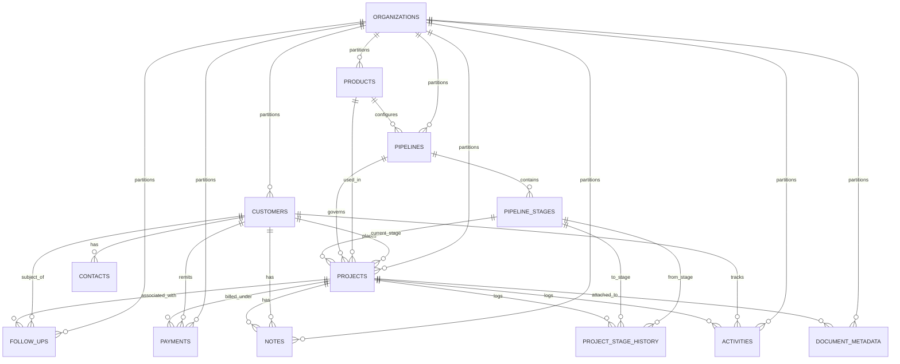

# Enermax CRM — Phase 2 Database Design & Schema Specification

## 1. Entity Relationship Diagram



---

## 2. Table Specifications

### 2.1 `customers`
* **Purpose**: Primary customer record.
* **Fields**:
  - `id`: UUID (PK)
  - `tenant_id`: UUID (FK to `organizations.id`, ondelete="CASCADE", indexed)
  - `customer_type`: String(50) (e.g. `commercial`, `industrial`, `residential`, `institution`)
  - `name`: String(255) (Indexed, Company or Individual name)
  - `email`: String(255) (Nullable, indexed)
  - `phone`: String(50) (Nullable, indexed)
  - `address_line1`: String(255) (Nullable)
  - `address_line2`: String(255) (Nullable)
  - `city`: String(100) (Nullable, indexed)
  - `state`: String(100) (Nullable, indexed)
  - `postal_code`: String(20) (Nullable)
  - `country`: String(100) (Default "India")
  - `status`: String(50) (Default "active")
  - `source`: String(100) (e.g. `referral`, `website`, `direct_call`)
  - `created_by_id`: UUID (FK to `users.id`, nullable)
  - `created_at`, `updated_at`: Timestamps

### 2.2 `contacts`
* **Purpose**: Individual stakeholders belonging to a customer.
* **Fields**:
  - `id`: UUID (PK)
  - `tenant_id`: UUID (FK to `organizations.id`, ondelete="CASCADE", indexed)
  - `customer_id`: UUID (FK to `customers.id`, ondelete="CASCADE", indexed)
  - `name`: String(255) (Indexed)
  - `designation`: String(100) (Nullable)
  - `phone`: String(50) (Nullable, indexed)
  - `email`: String(255) (Nullable, indexed)
  - `is_primary`: Boolean (Default false)
  - `notes`: Text (Nullable)
  - `created_at`, `updated_at`: Timestamps

### 2.3 `products`
* **Purpose**: Product & service catalog.
* **Fields**:
  - `id`: UUID (PK)
  - `tenant_id`: UUID (FK to `organizations.id`, ondelete="CASCADE", indexed)
  - `name`: String(255) (Indexed)
  - `code`: String(100) (Nullable, indexed, SKU/Code)
  - `category`: String(100) (Nullable, indexed)
  - `description`: Text (Nullable)
  - `unit_price`: Numeric(15, 2) (Default 0.00)
  - `is_active`: Boolean (Default true)
  - `created_at`, `updated_at`: Timestamps

### 2.4 `pipelines` & `pipeline_stages`
* **Purpose**: Flexible, product-specific workflow pipelines.
* **Fields in `pipelines`**:
  - `id`: UUID (PK)
  - `tenant_id`: UUID (FK to `organizations.id`, ondelete="CASCADE", indexed)
  - `name`: String(255)
  - `product_id`: UUID (FK to `products.id`, ondelete="SET NULL", nullable=True)
  - `is_default`: Boolean (Default false)
  - `is_active`: Boolean (Default true)
  - `created_at`, `updated_at`: Timestamps
* **Fields in `pipeline_stages`**:
  - `id`: UUID (PK)
  - `tenant_id`: UUID (FK to `organizations.id`, ondelete="CASCADE", indexed)
  - `pipeline_id`: UUID (FK to `pipelines.id`, ondelete="CASCADE", indexed)
  - `name`: String(100)
  - `order`: Integer (Sequence position)
  - `probability_percent`: Integer (Default 0 to 100)
  - `is_closed_won`: Boolean (Default false)
  - `is_closed_lost`: Boolean (Default false)
  - `color`: String(20) (Default "cyan")
  - `created_at`, `updated_at`: Timestamps

### 2.5 `projects`
* **Purpose**: Central operational hub for customer engagements.
* **Fields**:
  - `id`: UUID (PK)
  - `tenant_id`: UUID (FK to `organizations.id`, ondelete="CASCADE", indexed)
  - `project_number`: String(50) (Indexed, unique within tenant)
  - `name`: String(255) (Indexed)
  - `customer_id`: UUID (FK to `customers.id`, ondelete="RESTRICT", indexed)
  - `product_id`: UUID (FK to `products.id`, ondelete="SET NULL", nullable=True, indexed)
  - `pipeline_id`: UUID (FK to `pipelines.id`, ondelete="RESTRICT", indexed)
  - `stage_id`: UUID (FK to `pipeline_stages.id`, ondelete="RESTRICT", indexed)
  - `description`: Text (Nullable)
  - `value`: Numeric(15, 2) (Strict Decimal, default 0.00)
  - `currency`: String(10) (Default "INR")
  - `expected_completion_date`: Date (Nullable)
  - `status`: String(50) (Default "active")
  - `priority`: String(20) (Default "medium")
  - `owner_id`: UUID (FK to `users.id`, nullable=True, indexed)
  - `created_at`, `updated_at`: Timestamps

### 2.6 `project_stage_history`
* **Purpose**: Immutable audit log of project stage transitions.
* **Fields**:
  - `id`: UUID (PK)
  - `tenant_id`: UUID (FK to `organizations.id`, ondelete="CASCADE", indexed)
  - `project_id`: UUID (FK to `projects.id`, ondelete="CASCADE", indexed)
  - `from_stage_id`: UUID (FK to `pipeline_stages.id`, nullable=True)
  - `to_stage_id`: UUID (FK to `pipeline_stages.id`, nullable=False)
  - `changed_by_id`: UUID (FK to `users.id`, nullable=True)
  - `notes`: Text (Nullable)
  - `changed_at`: Timestamp (Default func.now())

### 2.7 `follow_ups`
* **Purpose**: Actionable follow-up tasks.
* **Fields**:
  - `id`: UUID (PK)
  - `tenant_id`: UUID (FK to `organizations.id`, ondelete="CASCADE", indexed)
  - `customer_id`: UUID (FK to `customers.id`, ondelete="CASCADE", indexed)
  - `project_id`: UUID (FK to `projects.id`, ondelete="SET NULL", nullable=True, indexed)
  - `title`: String(255)
  - `description`: Text (Nullable)
  - `due_date`: DateTime(timezone=True) (Indexed)
  - `status`: String(30) (Default "pending", indexed)
  - `priority`: String(20) (Default "medium")
  - `completed_at`: DateTime(timezone=True) (Nullable)
  - `completed_notes`: Text (Nullable)
  - `assigned_to_id`: UUID (FK to `users.id`, nullable=True)
  - `created_by_id`: UUID (FK to `users.id`, nullable=True)
  - `created_at`, `updated_at`: Timestamps

### 2.8 `payments`
* **Purpose**: Commercial payment milestones and receipts.
* **Fields**:
  - `id`: UUID (PK)
  - `tenant_id`: UUID (FK to `organizations.id`, ondelete="CASCADE", indexed)
  - `customer_id`: UUID (FK to `customers.id`, ondelete="RESTRICT", indexed)
  - `project_id`: UUID (FK to `projects.id`, ondelete="RESTRICT", indexed)
  - `payment_number`: String(50) (Indexed)
  - `amount`: Numeric(15, 2) (Strict Decimal, > 0)
  - `currency`: String(10) (Default "INR")
  - `payment_date`: Date (Indexed)
  - `payment_method`: String(50) (e.g. `bank_transfer`, `cheque`, `upi`, `cash`)
  - `reference_number`: String(100) (Nullable, indexed)
  - `status`: String(30) (Default "received", indexed)
  - `notes`: Text (Nullable)
  - `recorded_by_id`: UUID (FK to `users.id`, nullable=True)
  - `created_at`, `updated_at`: Timestamps

### 2.9 `notes` & `document_metadata` & `activities`
* **Notes**: Polymorphic association to Customer, Project, Follow-up, or Payment with immutable author and timestamp.
* **Document Metadata**: File name, category, size, MIME type, and abstract storage URI.
* **Activities**: Chronological timeline of stage transitions, payments received, notes added, and customer updates.

---

## 3. Financial Decimal Precision Rule

Floating-point numbers (`FLOAT`, `REAL`, `DOUBLE PRECISION`) are **strictly prohibited** for financial calculations.
All project values and payment amounts use:
```sql
NUMERIC(15, 2)
```
Python representation uses `decimal.Decimal` to guarantee 0.00 rounding precision.
