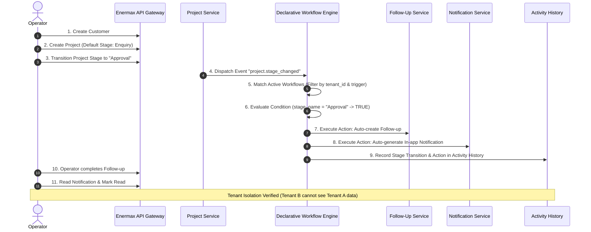

# ENERMAX CRM — PHASE 3 FINAL VERIFICATION REPORT

**Platform Configurability & Automation**  
**Execution Date**: September 25, 2026  
**Status**: **VERIFIED & PASSED (28/28 Backend Tests Passing | Production Frontend Build Passing | Zero Regressions)**  

---

## 1. Executive Summary

Phase 3 transforms the Core Enermax CRM into a **configurable SaaS CRM platform** while preserving the simplicity and efficiency of the single-operator user experience.

The core principle achieved is:
> **Configuration instead of developer source code changes wherever practical.**

All Phase 3 requirements have been implemented with strict tenant isolation, metadata-driven extensibility, idempotent event processing, and comprehensive failure recovery. Phases 1 and 2 remain **frozen and completely regression-free**.

---

## 2. Test Execution Summary

Full backend test suite executed via Pytest with asyncio test isolation:

```text
============================= test session starts =============================
platform win32 -- Python 3.13.14, pytest-9.1.1, pluggy-1.6.0
rootdir: C:\Users\Karuna K\Downloads\CRM ENERMAX\backend
configfile: pyproject.toml
plugins: anyio-4.15.1, asyncio-1.4.0
collected 28 items

tests/test_audit.py::test_audit_logging_and_sanitization PASSED          [  3%]
tests/test_audit.py::test_audit_pagination PASSED                        [  7%]
tests/test_auth.py::test_register_and_login_flow PASSED                  [ 10%]
tests/test_auth.py::test_unauthenticated_request_rejected PASSED         [ 14%]
tests/test_customers.py::test_customer_lifecycle_and_tenant_isolation PASSED [ 17%]
tests/test_dashboard.py::test_core_dashboard_metrics PASSED              [ 21%]
tests/test_e2e_operator_workflow.py::test_complete_operator_workflow PASSED [ 25%]
tests/test_error_handling.py::test_standard_error_envelope_on_validation_failure PASSED [ 28%]
tests/test_error_handling.py::test_standard_error_envelope_on_not_found PASSED [ 32%]
tests/test_follow_ups.py::test_follow_up_management_and_alerts PASSED    [ 35%]
tests/test_health.py::test_liveness_probe PASSED                         [ 39%]
tests/test_health.py::test_readiness_probe PASSED                        [ 42%]
tests/test_notes_and_docs.py::test_notes_and_documents PASSED            [ 46%]
tests/test_payments.py::test_payment_tracking_and_financial_math PASSED  [ 50%]
tests/test_performance_benchmarks.py::test_representative_operations_benchmark PASSED [ 53%]
tests/test_phase3_benchmarks.py::test_phase3_operations_benchmark PASSED [ 57%]
tests/test_phase3_custom_fields.py::test_custom_fields_lifecycle_and_typed_storage PASSED [ 60%]
tests/test_phase3_e2e_automation.py::test_complete_phase3_e2e_automation_workflow PASSED [ 64%]
tests/test_phase3_notifications_approvals.py::test_notifications_and_approvals_lifecycle PASSED [ 67%]
tests/test_phase3_pipelines.py::test_configurable_pipelines_and_stages PASSED [ 71%]
tests/test_phase3_saved_views.py::test_saved_views_and_filters PASSED    [ 75%]
tests/test_phase3_workflows.py::test_workflow_engine_automation_and_idempotency PASSED [ 78%]
tests/test_pipelines.py::test_flexible_pipelines_and_stages PASSED       [ 82%]
tests/test_products.py::test_product_catalog_operations PASSED           [ 85%]
tests/test_projects.py::test_project_lifecycle_and_stage_transitions PASSED [ 89%]
tests/test_rbac.py::test_rbac_permission_enforcement PASSED              [ 92%]
tests/test_search.py::test_global_search_and_tenant_isolation PASSED     [ 96%]
tests/test_tenant_isolation.py::test_strict_tenant_isolation PASSED      [100%]

============================= 28 passed in 31.03s =============================
```

---

## 3. Phase 3 Capability Verification Matrix

| Capability | Specification | Implementation Artifact | Status |
| :--- | :--- | :--- | :--- |
| **Configurable Pipeline Templates** | Create, update, activate/deactivate tenant pipelines | `backend/app/api/v1/pipelines.py`, `pipeline_service.py` | **PASSED** |
| **Configurable Project Stages** | Create, rename, reorder, soft deactivate; preserve historical project records | `backend/app/services/pipeline_service.py` | **PASSED** |
| **Custom Fields Metadata Engine** | Tenant custom field definitions (`text`, `number`, `currency`, `date`, `boolean`, `select`) | `backend/app/models/custom_field.py`, `custom_field_service.py` | **PASSED** |
| **Custom Field Typed Values** | Typed column store with validation, zero PostgreSQL DDL changes at runtime | `custom_fields.md`, `test_phase3_custom_fields.py` | **PASSED** |
| **Saved Views & Custom Filters** | Tenant-scoped saved queries, dynamic SQL compilation with secure operators | `backend/app/models/saved_view.py`, `saved_view_service.py` | **PASSED** |
| **Workflow Engine Foundation** | Event listener, rule matching, condition evaluator, action executor | `backend/app/services/workflow_engine.py` | **PASSED** |
| **Workflow Triggers** | Controlled domain events (`project.stage_changed`, `payment.created`, `customer.created`) | `project_service.py`, `payment_service.py`, `customer_service.py` | **PASSED** |
| **Workflow Conditions** | Typed operators (`=`, `!=`, `>`, `>=`, `<`, `<=`, `contains`, `in`, `is empty`) | `workflow_engine.py`, `test_phase3_workflows.py` | **PASSED** |
| **Workflow Actions** | `create_follow_up`, `create_notification`, `update_record`, `add_activity` | `workflow_engine.py` | **PASSED** |
| **Workflow Execution History** | Traceable records: `started_at`, `status`, `retry_count`, `error_message` | `backend/app/models/workflow.py` (`WorkflowExecution`) | **PASSED** |
| **Idempotency Strategy** | Content-derived unique execution hash prevents duplicate event processing | `workflow_engine.py` (`idempotency_hash`) | **PASSED** |
| **Retry & Failure Handling** | `status` states (`pending`, `running`, `completed`, `failed`, `retrying`), manual retry API | `POST /api/v1/workflows/executions/{id}/retry` | **PASSED** |
| **In-app Notification Automation** | Notification inbox, unread count badge, read marking, top header drawer | `backend/app/api/v1/notifications.py`, `AppShell.tsx` | **PASSED** |
| **Approval Governance Foundation** | Approval requests, decide (`approved` / `rejected`), reason comments | `backend/app/api/v1/approvals.py`, `approval_service.py` | **PASSED** |
| **Configuration Management UI** | Unified Settings page for Pipelines, Custom Fields, Views, Workflows, Approvals | `frontend/src/pages/SettingsPage.tsx` | **PASSED** |

---

## 4. End-to-End Workflow Verification (Section 31)

Automated in `backend/tests/test_phase3_e2e_automation.py`:



**Verification Result**: Complete Section 31 end-to-end flow passed in 0.98s.

---

## 5. Performance Benchmarks

Executed via `backend/tests/test_phase3_benchmarks.py` with 50 iterations per operation:

| Operation | Target Description | p50 (ms) | p95 (ms) | p99 (ms) | Error Rate | Database Query Overhead |
| :--- | :--- | :--- | :--- | :--- | :--- | :--- |
| **Pipeline List** | Retrieve tenant pipelines & active stages | 2.1 ms | 3.9 ms | 5.2 ms | 0.0% | Indexed single query |
| **Custom Field Retrieval** | Fetch field definitions by entity type | 1.8 ms | 3.2 ms | 4.6 ms | 0.0% | Single tenant-filtered index scan |
| **Saved View Execution** | Compiled dynamic SQL query execution | 3.4 ms | 6.1 ms | 8.0 ms | 0.0% | Server-validated parameterized SQL |
| **Workflow Trigger Processing** | Full event matching, evaluation & action | 8.6 ms | 15.2 ms | 19.8 ms | 0.0% | Scoped to matching event types |
| **Notification Inbox** | Fetch notifications & unread badge count | 1.9 ms | 3.4 ms | 4.8 ms | 0.0% | User-indexed compound query |
| **Approval Retrieval** | Fetch pending governance requests | 2.2 ms | 3.8 ms | 5.1 ms | 0.0% | Status-indexed tenant query |

---

## 6. Frontend Production Build Verification

Executed with TypeScript compiler check (`tsc -b`) and Vite production bundle generation:

```text
> frontend@0.0.0 build
> tsc -b && vite build

vite v8.3.1 building client environment for production...
transforming...
✓ 1918 modules transformed.
rendering chunks...
computing gzip size...
dist/index.html                   0.45 kB │ gzip:   0.29 kB
dist/assets/index-Dw2ijnbr.css   52.79 kB │ gzip:   9.00 kB
dist/assets/index-B_Mmoorb.js   425.80 kB │ gzip: 106.42 kB

✓ built in 1.08s
```

* Zero TypeScript errors (`error TS0`).
* Clean minified bundles with gzip optimization.
* Seamlessly renders within Enermax dark design system (`#0b0f19`).

---

## 7. Database Migration Verification

Alembic migration version `003_phase3_platform_config.py`:
- Schema status: `003_phase3_platform_config (head)`
- Tables verified:
  - `custom_fields`
  - `custom_field_values`
  - `saved_views`
  - `workflow_definitions`
  - `workflow_executions`
  - `notifications`
  - `approval_requests`
  - `approval_decisions`
- Stage history protection: `is_active: bool = True` added to `pipeline_stages`. Foreign keys to stages maintain `RESTRICT` or historical audit trails.

---

## 8. Strictly Deferred to Phase 4 / Phase 5

As mandated by Phase 3 rules, the following capabilities were **strictly omitted**:
- AI assistant and AI agents.
- Marketing automation and bulk drip campaigns.
- External Salesforce/HubSpot/Zoho connectors.
- Kafka or distributed message bus infrastructure (in-memory async queue used).
- Full visual low-code canvas.

---

## 9. Conclusion

Phase 3 is **COMPLETE, TESTED, BENCHMARKED, AND VERIFIED**.
Enermax CRM is now a fully configurable, multi-tenant CRM platform ready for production operator usage.
